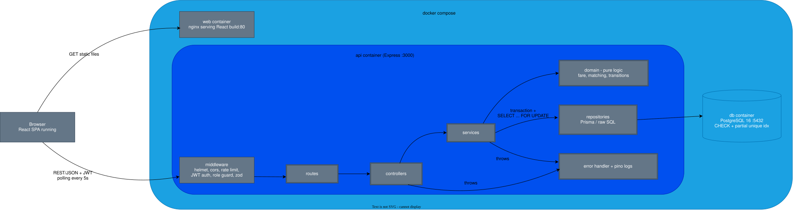
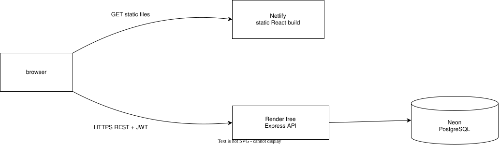

# Architecture

## System Diagram (docker compose)

## Production Diagram

## Web container and nginx

In `docker compose`, the `web` container is a multi-stage build:

1. **Build stage:** Node runs `npm run build` and produces `dist/`.
2. **Final stage:** nginx serves `dist/` as static files. There is no Node in the final image, so it stays small.

Decisions:

- **nginx only serves files. It is not a reverse proxy.** The browser calls the Express API directly at `VITE_API_URL`, exactly as it does in production. The API's CORS allowlist must include the web origin.
- **`VITE_API_URL` is a build-time value.** Vite bakes it into the JS bundle, so compose passes it as a build arg. Changing it means rebuilding the web image.
- **`try_files $uri /index.html`** serves the SPA for routes like `/driver`, so a page refresh works instead of returning 404.
- **Same build as production:** the evaluator sees the `vite build` output, not the dev server.
- **Production uses no nginx.** Netlify serves the same `dist/` files (with an SPA redirect to `index.html`).

Why nginx: it is a tiny, well-known static server that I can explain and debug. Alternatives: `serve` (needs Node) or the Vite dev server (not a production build). Switch to something else if the frontend needs server-side rendering.

## How a request flows

1. The browser loads the React app (static files) and calls the API with a JWT bearer token.
2. **Routes** map URLs to controllers, and middleware handles auth, validation and logging.
3. **Controllers** are thin: they read the request and send the response.
4. **Services** hold the business logic and open the DB transactions (e.g. joining a pool).
5. **Domain** holds pure functions with no DB access (fare calculation, matching rule, state transitions), so they are easy to unit test.
6. **Repositories** are the only layer that talks to PostgreSQL.

## Why this shape

- **Layers, not microservices:** one API and one DB is enough for an MVP. Splitting would add failure modes without solving a real problem.
- **Polling, not WebSockets:** the UI re-fetches every 5 seconds. It needs no extra infrastructure, and it is fine at MVP scale.
- **Business rules in one place:** capacity and state rules live in services and domain, not in the controllers or the frontend. The DB adds a last safety net with CHECK constraints.
