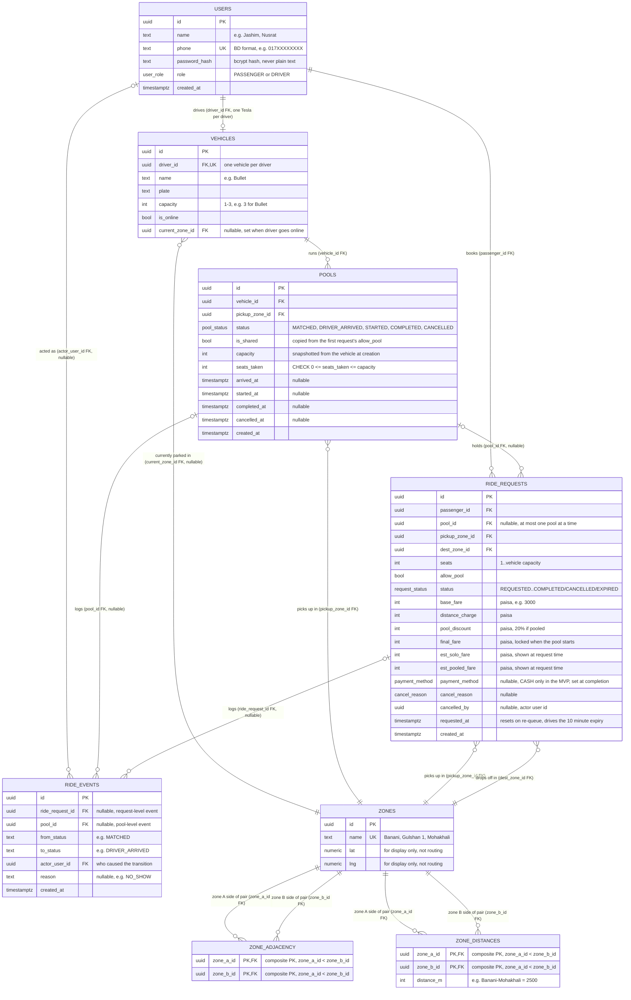

# Dhaka Tesla Pool — Database (ERD)


## Mermaid — AI-generated, for a more readable view



## Enums
| Enum | Values |
|---|---|
| `user_role` | PASSENGER, DRIVER |
| `request_status` | REQUESTED, MATCHED, DRIVER_ARRIVED, STARTED, COMPLETED, CANCELLED, EXPIRED |
| `pool_status` | MATCHED, DRIVER_ARRIVED, STARTED, COMPLETED, CANCELLED |
| `payment_method` | CASH (TESLAPAY is a stretch goal) |
| `cancel_reason` | PASSENGER, NO_SHOW |

## Constraints and indexes (added by hand in the migration SQL)
```sql
-- capacity can never be exceeded, even by buggy code
ALTER TABLE pools ADD CONSTRAINT pools_seats_within_capacity
  CHECK (seats_taken >= 0 AND seats_taken <= capacity);

-- a Tesla has between 1 and 3 seats (assumption: Bullet has 3, so 3 is the max)
ALTER TABLE vehicles ADD CONSTRAINT vehicles_capacity_range
  CHECK (capacity BETWEEN 1 AND 3);

-- one active ride per passenger (also blocks double-submit)
CREATE UNIQUE INDEX one_active_request_per_passenger
  ON ride_requests (passenger_id)
  WHERE status IN ('REQUESTED','MATCHED','DRIVER_ARRIVED','STARTED');

-- one active pool per vehicle
CREATE UNIQUE INDEX one_active_pool_per_vehicle
  ON pools (vehicle_id)
  WHERE status IN ('MATCHED','DRIVER_ARRIVED','STARTED');

ALTER TABLE ride_requests ADD CONSTRAINT pickup_differs_from_dest
  CHECK (pickup_zone_id <> dest_zone_id);
ALTER TABLE ride_requests ADD CONSTRAINT seats_positive CHECK (seats >= 1);
ALTER TABLE ride_requests ADD CONSTRAINT fares_non_negative CHECK (
  coalesce(final_fare,0) >= 0 AND coalesce(pool_discount,0) >= 0);
ALTER TABLE zone_adjacency ADD CONSTRAINT adjacency_ordered CHECK (zone_a_id < zone_b_id);
ALTER TABLE zone_distances ADD CONSTRAINT distances_ordered CHECK (zone_a_id < zone_b_id);

-- indexes for the hot queries
CREATE INDEX ride_requests_feed    ON ride_requests (status, pickup_zone_id); -- driver feed
CREATE INDEX ride_requests_pool    ON ride_requests (pool_id);               -- pool members
CREATE INDEX ride_requests_history ON ride_requests (passenger_id, created_at DESC);
CREATE INDEX pools_open            ON pools (status, pickup_zone_id);        -- auto-join lookup
CREATE INDEX ride_events_request   ON ride_events (ride_request_id);
CREATE INDEX ride_events_pool      ON ride_events (pool_id);
```

## Why each table exists
| Table | Why |
|---|---|
| `users` | One table for both roles. Passengers and drivers share login, and a role column keeps auth simple. |
| `vehicles` | Capacity belongs to the vehicle, not the driver. `UNIQUE(driver_id)` enforces one Tesla per driver for the MVP. |
| `zones` | Predefined Dhaka areas instead of a map API (PRD §4). |
| `zone_adjacency` | The matching rule's data. Stored with `a < b` so each pair exists once. |
| `zone_distances` | Fixed distances so fares are hand-checkable. Not computed live. |
| `pools` | One vehicle trip. A solo ride is a pool with one member. `capacity` is **snapshotted** so the CHECK constraint works inside one row. |
| `ride_requests` | One passenger's trip, status, and fare. `pool_id` is the pool membership (a request is in at most one pool, so no join table). |
| `ride_events` | Append-only audit trail: "explain exactly what happened, in case anyone asks later" (PRD §2). |

## Key design choices
- **Money in integer paisa** (`int`): no float rounding, exact test equality. Max ≈ ৳21 million per value, far above any fare.
- **Fare breakdown stored on the row**, not recomputed: if the rates change later, old rides still show what was actually charged.
- **`seats_taken` is a stored counter, not `SUM(seats)`**: it can be locked and CHECK-constrained in one row. Trade-off: it must stay in sync with members, so it's only ever changed inside the same transaction that attaches or detaches a request.
- **UUID ids**: not guessable from the URL. Ownership is still checked (404 for other people's rides).
- **No per-status timestamps on `pools` / `ride_requests`**: `ride_events` already records when every status change happened, so we don't store the same fact twice.
- **`requested_at` resets on re-queue**, so a passenger bounced by a driver cancel doesn't instantly expire.

See [fare-and-matching.md](fare-and-matching.md) for the fare formula and [lifecycle.md](lifecycle.md) for the status flows.
