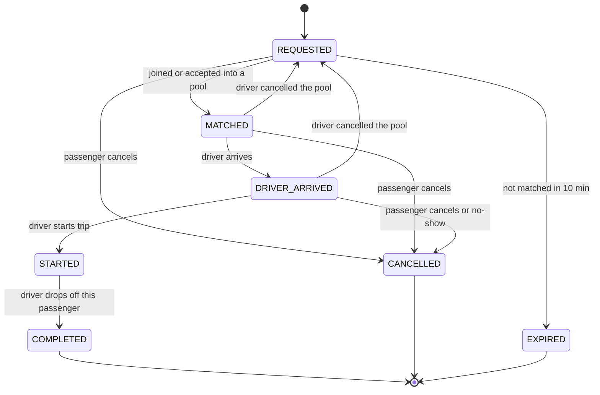
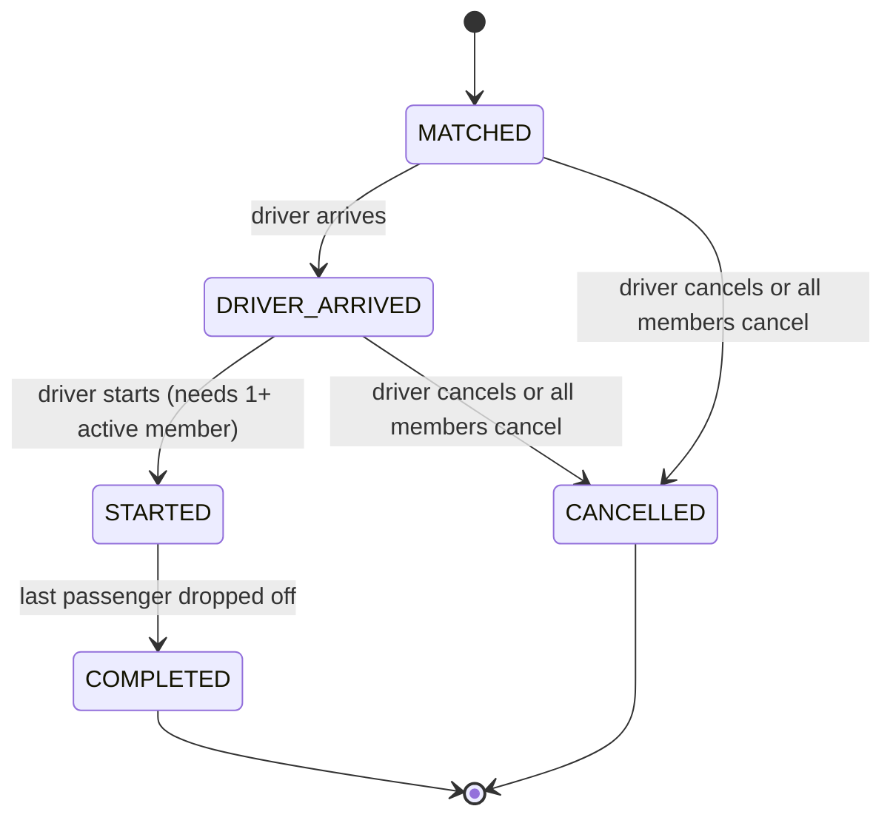

# Ride & Pool Lifecycles

The brief suggests one lifecycle. In a pool, each passenger needs their **own** status (Nusrat can cancel while Rafiq still rides) and passengers get dropped off at different places. So we keep **two** state machines: one per passenger request, one per vehicle trip (pool).

## Ride request (per passenger)

## Pool (per vehicle trip)

## Rules

- All allowed transitions live in **one table-driven module**. Anything else returns `409 INVALID_TRANSITION`.
- Every transition writes a `ride_events` row (from, to, actor, reason, time).
- **Joining is only allowed while the pool is `MATCHED`.** Once the driver marks arrival, the pool is sealed.
- "Arrived" applies to the whole pool, because everyone shares the pickup zone.
- The driver can start only with at least one active member.
- The driver drops off each passenger individually. The pool completes when no `STARTED` members remain.
- Requests not matched within 10 minutes become `EXPIRED`. This is checked lazily on read/write, with no cron job or queue.

## Cancellation rules

| Who | Allowed when | Effect |
|---|---|---|
| Passenger | `REQUESTED`, `MATCHED`, `DRIVER_ARRIVED` | Request → `CANCELLED`, seats freed. No fee in the MVP. |
| Passenger | `STARTED` or later | Rejected (409) |
| Driver cancels pool | before `STARTED` | Pool → `CANCELLED`. Members go **back to `REQUESTED`**, so passengers aren't punished. |
| Driver marks no-show | `DRIVER_ARRIVED` | That request → `CANCELLED` (reason `NO_SHOW`) |
| Last member cancels | before `STARTED` | Pool → `CANCELLED` |
