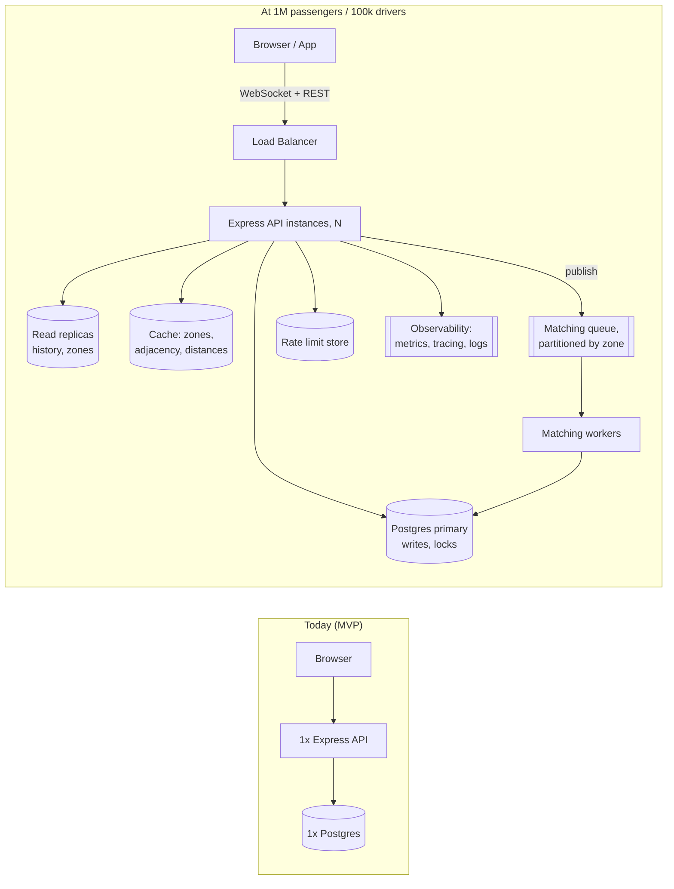

# Scaling — "If Oi Tesla Goes Viral"

Bonus reasoning only (rules.md A15): what breaks going from the current MVP (one Tesla, four seeded users, one free-tier server) to **1M passengers and 100k drivers**, and how each piece would change. Nothing here is built — the MVP intentionally stays simple (rules.md A9: no microservices, Kafka, Kubernetes, Redis, or queues just to look advanced).

## Today's shape, in one sentence

One Express process, one Postgres database, JWT auth (stateless, no session store), 5-second polling, zones/adjacency/distances as seeded static data, row locks (`SELECT ... FOR UPDATE`) for capacity safety. This is correct and cheap at MVP scale, and every limitation below is a direct, known consequence of that shape, not an accident.

## 1. Load balancing & horizontal scaling

**Today:** one Render instance serves every request.
**At scale:** stateless is the enabling property here — JWT auth means any instance can validate any request without shared session state, so the API can already run as N identical instances behind a load balancer with zero code changes to auth. Add a health-checked load balancer (or a managed platform's built-in one), scale instances by CPU/request-rate, and the app layer scales horizontally almost for free. The database does not scale this way (see below) — it stays the bottleneck.

## 2. DB indexing / read replicas

**Today:** a handful of purpose-built indexes (`ride_requests (status, pickup_zone_id)` for the driver feed, `pools (status, pickup_zone_id)`, `(passenger_id, created_at DESC)` for history) — enough for a table with dozens of rows.
**At scale:** those same indexes still apply, just under real load. The split that matters is **reads vs. writes**: ride history, zone lists, and driver history are read-heavy and tolerate slightly stale data — route them to read replicas. Anything that touches `seats_taken` or a status transition must stay on the primary, since those need the strong consistency `FOR UPDATE` provides. Getting this split wrong (e.g. reading `seats_taken` from a lagging replica right before a join decision) would silently reintroduce the exact overbooking bug the MVP's locking prevents.

## 3. Caching

**Today:** no cache layer — zones, adjacency, and distances are static seed data queried directly every time, which is fine because the whole table is a few dozen rows.
**At scale:** zones/adjacency/distances are perfect cache candidates (they never change from user action, only from an admin re-seeding), so they'd move to an in-memory cache (Redis, or even an in-process cache refreshed on a timer) and stop hitting Postgres at all for every fare estimate or matching check. Anything about *current* state (seats taken, pool status) must **not** be cached the same way — that's exactly the data the locking strategy depends on being live.

## 4. Geospatial search

**Today:** a fixed list of 9 Dhaka zones with a seeded pairwise adjacency table — deliberately not real geography, so fares are hand-checkable and the matching rule is exact and explainable (rules.md A2).
**At scale:** a fixed zone list stops working once locations are real GPS points instead of "pick from 9 areas." That's PostgreSQL's own reason to be the DB choice here already (rules.md B1) — PostGIS adds real geospatial indexes (`ST_DWithin`, GiST indexes) so "find compatible drivers within 2km" becomes a real spatial query instead of a lookup table. This is the single most structural change in this whole document — the matching rule itself would need to change from "same/adjacent zone" to "within a radius," which changes the fare model's hand-checkability too.

## 5. Queues / events

**Today:** matching happens synchronously, inline in the same request/transaction that creates the ride (`tryAutoJoin`) — deliberately, since rules.md A9 bans queues for the MVP and synchronous matching is easy to test and reason about.
**At scale:** with 100k drivers, scanning for a compatible open pool on every single ride request becomes real contended work, and doing it synchronously inside an HTTP request ties up a connection for the whole search. This is where an event/queue model earns its keep: a ride request publishes an event, a pool of matching workers (partitioned by zone, so Banani's matching load never contends with Gulshan's) picks it up and finds/creates a pool asynchronously, and the passenger's client polls or gets pushed the result. This directly extends rules.md B8's own stated scaling answer: "partition matching by zone into dedicated workers/queues."

## 6. Real-time communication

**Today:** the frontend polls every 5 seconds (`refetchInterval`) — zero extra infrastructure, fine for a handful of concurrent users (rules.md B1).
**At scale:** a million polling clients hitting `/rides?scope=active` every 5 seconds is a massive constant-load floor even when nothing has changed. WebSockets or Server-Sent Events push updates only when a ride's status actually changes, trading a stateful connection (needs sticky routing or a pub/sub layer like Redis to fan out across load-balanced instances) for a large reduction in wasted request volume.

## 7. Rate limiting

**Today:** `express-rate-limit` on `/auth/*` only (20 requests / 15 min / IP), in-memory — correct for a single instance.
**At scale:** in-memory rate limiting breaks the moment there's more than one API instance, since each instance counts independently (a limit of 20 becomes an effective limit of 20 × N instances). It needs a shared store (Redis) so all instances agree on one counter per key. Rate limiting would also need to expand past just `/auth/*` — a booking endpoint hit by a scripted client is just as real a risk at scale as a login brute-force attempt.

## 8. Idempotency

**Today:** the partial unique index `one_active_request_per_passenger` already makes a double-clicked "Request ride" safe — the second insert just fails the constraint, and the MVP tests this exact scenario.
**At scale:** the same principle needs to extend past the database's own constraints to the network layer, where retries are much more common (mobile networks, load balancers retrying timed-out requests). Client-supplied idempotency keys on mutating endpoints (`POST /rides`, `/accept`, `/dropoff`) let the server recognize "this is the same request retried," not "this is a second real request," independent of which specific DB constraint happens to catch it.

## 9. Observability

**Today:** structured JSON logs via pino + a request id per request (rules.md B1) — enough to read logs by hand for a handful of users.
**At scale:** logs alone don't scale to being useful across a fleet of instances and a million users. This needs three additions: **metrics** (request latency, error rate, queue depth, matching success rate — things you'd graph, not grep), **distributed tracing** (one request id following a ride through matching, driver notification, and fare settlement across multiple services), and **alerting** on the metrics that actually predict user-facing problems (e.g. matching latency climbing, not just raw CPU).

## 10. DB contention

**Today:** the whole concurrency strategy (rules.md B8) is `SELECT ... FOR UPDATE` on the pool row, with lock order always pool → request. This is provably correct and is directly exercised by the concurrency tests (Nusrat vs. Shirin for the last seat, two drivers accepting the same request). It's fine because contention per pool tops out at 3 seats.
**At scale:** row locks are still fine **per pool** — a single Tesla's 3 seats being contended by a handful of nearby passengers doesn't change just because there are a million users elsewhere in the city. The actual bottleneck at scale isn't lock contention on any one row, it's the **volume of matching attempts** hitting the database at once city-wide — which is exactly why item 5 (queues, zone-partitioned matching workers) is the real fix, not tighter locking.

## 11. Ride matching (algorithmic, not just concurrency)

**Today:** `canJoin` is a pure, pairwise, O(members) check against a small seeded adjacency list — deliberately simple and exact (rules.md A2, B2).
**At scale:** with real geography (item 4) and far more waiting requests per zone, "check every waiting request against every open pool" stops being cheap. This is where a proper geospatial index plus a bounded search radius (find open pools within Xkm, not "all of them") keeps matching fast, and where the queue-based worker model (item 5) keeps it from blocking request threads.

## 12. Retry / failure strategy

**Today:** the MVP's failure model is mostly "the transaction rolls back cleanly, the client sees a clear error" (e.g. `RIDE_UNAVAILABLE`, `RIDE_CHANGED`) — correct but synchronous, with no background retries because there's no async work yet.
**At scale:** once matching and notifications move to queues (item 5), failures become asynchronous too — a matching worker can crash mid-job. That needs at-least-once delivery with idempotent handlers (item 8 again), dead-letter queues for jobs that fail repeatedly (so a bad ride request doesn't silently vanish or infinitely retry), and circuit breakers around any external dependency so one slow downstream service doesn't cascade into every worker blocking.

## 13. Security

**Today:** helmet, CORS allowlist, bcrypt, JWT with 1-day expiry, zod validation on every input, rate-limited auth routes (rules.md B10) — solid basics for an MVP with a handful of known users.
**At scale:** a bigger surface needs a few additions beyond "more of the same": short-lived access tokens + refresh tokens instead of a single 1-day JWT (limits the damage window of a leaked token — already flagged as a documented trade-off in rules.md B1), a WAF/DDoS layer in front of the load balancer, secrets management (rotating `JWT_SECRET` without downtime, which a single `.env` value can't do), and much finer audit logging given `ride_events` already exists as the audit trail's foundation.

## 14. Deployment strategy

**Today:** Neon (DB) + Render (API) + Vercel (web), all free tier, deployed manually through each dashboard (see the README's Docker/deployment sections) — correct for a project with one contributor and no uptime requirement.
**At scale:** this becomes a real CI/CD pipeline (build → test → deploy automatically on merge, not manual dashboard clicks), blue-green or rolling deploys so a bad release doesn't take down the whole fleet at once, infrastructure-as-code (so environments are reproducible instead of hand-configured through UIs), and a move off Render's free tier specifically to remove the cold-start behavior documented in the README's Known Limitations — free-tier sleep is fine for a demo, never acceptable for real traffic.

## Diagram: today vs. at scale

## What stays true at any scale

The core correctness properties don't change just because the numbers get bigger:

- Seat capacity is still enforced by a database `CHECK` constraint as the last line of defense, independent of every layer above it.
- Fares are still integer money, never floats.
- The matching rule is still one pure, testable function — it just runs against a spatial index instead of a static adjacency table.
- Every status transition still goes through one table-driven transition check and writes an audit event.

Scaling changes *where* work happens and *how fast* it happens. It doesn't change what "correct" means for this app.
